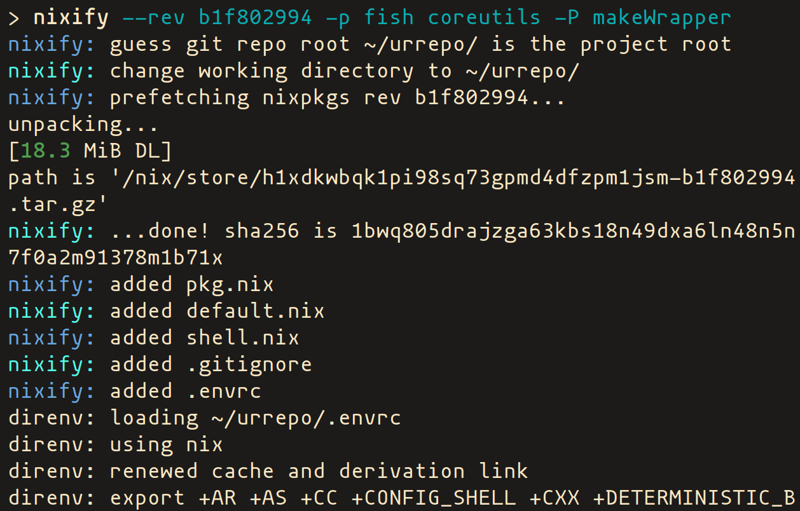

# nixify

[](https://travis-ci.org/mnacamura/nixify)

A little tool to init nix and direnv environment, inspired by some nixify
precedents.

## Example 



## Usage

```
> nixify --help
Usage: nixify [-r|--rev REV [--sha256 SHA256]] [-n|--pname NAME] [-v|--version VERSION] [-p|--build-inputs [PKG...]] [-P|--native-build-inputs [PKG...]] [-s|--shell-build-inputs [PKG...]] [-h|--help] [-V] [DEST]

A little tool to init nix and direnv environment.

Arguments:
    DEST                                install files into DEST (optional)

Options:
    -r, --rev REV                       pin nixpkgs to revision hash REV
        --sha256 SHA256                 sha256 checksum of the pinned nixpkgs (optional)
    -n, --pname NAME                    set package pname to NAME
    -v, --version VERSION               set package version to VERSION
    -p, --build-inputs [PKG...]         set packages in buildInputs
    -P, --native-build-inputs [PKG...]  set packages in nativeBuildInputs
    -s, --shell-build-inputs [PKG...]   set packages in buildInputs of shell.nix

Flags:
    -h, --help                          show help
    -V                                  show program version
```

## Installation

```
> git clone https://github.com/mnacamura/nixify.git $SOMEWHERE
> ln -s $SOMEWHERE/nixify-overlay.nix ~/.config/nixpkgs/overlays/ 
> nix-env -f '<nixpkgs>' -iA nixify           # for the latest release, or
> nix-env -f '<nixpkgs>' -iA nixify-unstable  # for the latest unstable version
```

### Dependencies

- `bash`
- `coreutils`
- `nix`
- `direnv`

## License

[MIT](LICENSE)
